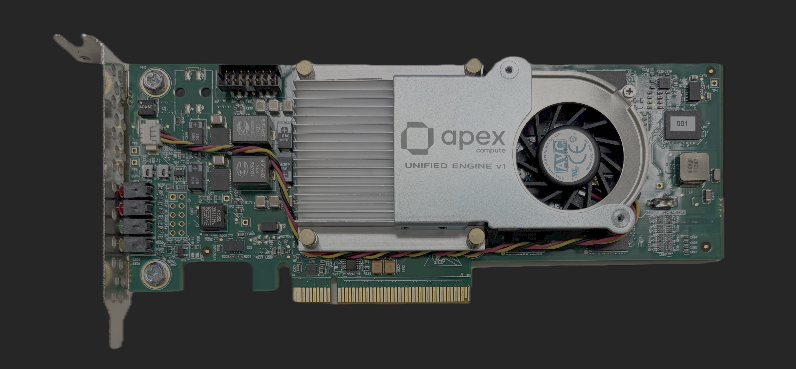
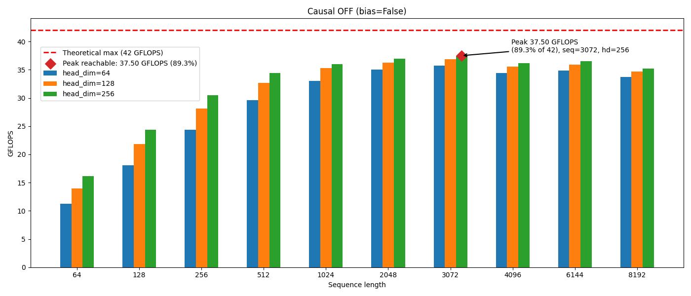
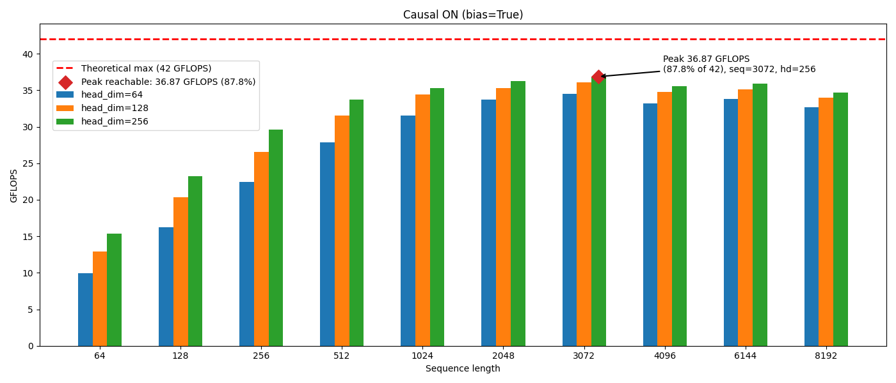
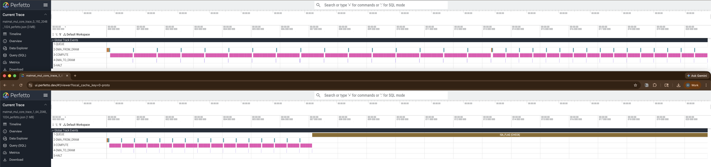

<p align="center">
  
</p>

<p align="center">
  Contributors: Hasan Unlu, Siqin Liu, Tin Nguyen, Rohit Rao, Dave Wei, Hiruna Vishwamith, Yinuo Zhao
</p>

<p align="center">
  Contact:
  <a href="mailto:hunlu@apexcompute.com">hunlu@apexcompute.com</a>,
  <a href="mailto:siqin.liu@apexcompute.com">siqin.liu@apexcompute.com</a>,
  <a href="mailto:tin.nguyen@apexcompute.com">tin.nguyen@apexcompute.com</a>,
  <a href="mailto:rohit@apexcompute.com">rohit@apexcompute.com</a>,
  <a href="mailto:dave.wei@apexcompute.com">dave.wei@apexcompute.com</a>,
  <a href="mailto:hiruna@apexcompute.com">hiruna@apexcompute.com</a>,
  <a href="mailto:yinuo.zhao@apexcompute.com">yinuo.zhao@apexcompute.com</a>
</p>

<p align="center">
  <a href="update_51a8552.bin">&#9881;&#65039; Hardware Architecture Update (51a8552.bin)</a>
</p>

<p align="center">
  <a href="#"></a><br>
  <a href="https://buy.stripe.com/6oUaEQf6365bgAt0QHds401">&#128722; Purchase FPGA Board with Unified Engine IP Block for $49.99</a><br>
  Includes ongoing hardware design updates so you always have the latest architecture.
</p>

<p align="center">
  <a href="http://discord.gg/hr9BwTUx"></a>
</p>

# XDMA Driver Setup and Usage Guide

This guide covers installation and usage of the Xilinx XDMA driver for PCIe-based FPGA communication.

## Prerequisites

- Kernel headers installed: `sudo apt install linux-headers-$(uname -r)`

## Installation

### 1. Install XDMA Driver from Xilinx Repository

Clone the official Xilinx DMA driver repository:
```bash
git clone https://github.com/Xilinx/dma_ip_drivers.git
cd dma_ip_drivers/XDMA/linux-kernel/xdma
sudo make install
```
> **Tip:** If `sudo make install` fails, you may need to disable Secure Boot in your BIOS settings.

### 2. Load the Driver

Load the XDMA driver with interrupt mode 0 (auto-detect):
```bash
sudo insmod /lib/modules/$(uname -r)/xdma/xdma.ko interrupt_mode=0
```

### 3. Load the Driver Every Boot Automatically (Recommended)

Apply the following script
```bash
# 1. Remove any conflicting configs
sudo rm -f /etc/modprobe.d/blacklist-xdma.conf \
           /etc/modprobe.d/xdma.conf \
           /etc/modules-load.d/xdma.conf

# 2. Create systemd service
sudo tee /etc/systemd/system/xdma.service << 'EOF'
[Unit]
Description=Xilinx XDMA Driver
After=local-fs.target

[Service]
Type=oneshot
ExecStart=/bin/sh -c '/sbin/insmod /lib/modules/$(uname -r)/xdma/xdma.ko || true'
ExecStartPost=/bin/sh -c 'chmod 666 /dev/xdma*'
RemainAfterExit=yes

[Install]
WantedBy=multi-user.target
EOF

# 3. Enable and start
sudo systemctl daemon-reload
sudo systemctl enable xdma
sudo systemctl restart xdma

# 4. Verify
sudo systemctl status xdma
ls -la /dev/xdma* | head -5
```

### 4. Set Up Python Environment

```bash
python3 -m venv ~/my_torch_env
source ~/my_torch_env/bin/activate
pip install -r requirements.txt
```

### 5. Run Hardware Tests

```bash
python3 user_hw_test.py
```

### 6. Run Gemma3 Inference (requires Hugging Face)

The Gemma3 test downloads the gated [google/gemma-3-1b-it](https://huggingface.co/google/gemma-3-1b-it) model from Hugging Face. You need to:

1. Create a Hugging Face account at https://huggingface.co
2. Accept the Gemma license at https://huggingface.co/google/gemma-3-1b-it
3. Create an access token at https://huggingface.co/settings/tokens
4. Log in from the command line:

```bash
pip install huggingface-hub
huggingface-cli login
```

Then run:

```bash
cd gemma3_example
python3 gemma3_test.py --prompt "your prompt"
```

### 7. Updating HW bin file
```
python3 update_flash.py update_xxxxxxxx.bin
```
Cold reboot the PC.

---

## Apex Compute Unified Engine v1.1 — Benchmark Results

All benchmarks were collected on RTL running on a Kintex UltraScale+ FPGA in real time.

### Benchmark Datasheet

<a href="media/benchmark_datasheet.pdf">📄 Download Benchmark Datasheet (PDF)</a>

| Specification | Value |
|---|---|
| Engine frequency | 333 MHz |
| Theoretical peak (BF16) | 42 GFLOPS/s |
| Memory interface | DDR4 @ 1333 MHz, 32-bit |
| AXI Master Data Width | 256 bits |
| On-chip SRAM | 1.05 MB |
| Total power | 4.5 W |
| BF16 MatMul | 40.17 GFLOPS/s (95.6% utilization) |
| BF16 MatMul + Bias + Activation | 40.03 GFLOPS/s (95.3% utilization) |
| BF16 Softmax MatMul | 37.76 GFLOPS/s (89.9% utilization) |
| Memory-Efficient Attention | ~90% utilization |
| Quantized MatMul (BF16 × INT4/FP4) | 40.03 GFLOPS/s (95.3% utilization) |
| Quantized MatVec (Streaming matrix, decoding mode friendly) (BF16 × INT4/FP4) | 31.33 GFLOPS/s (74.6% utilization) |
| RMSNorm | 4.81 GFLOPS/s |
| LayerNorm | 5.90 GFLOPS/s |
| Quantize (BF16 → INT4/FP4) | 5.72 GFLOPS/s |
| Dequantize (INT4/FP4 → BF16) | 3.31 GFLOPS/s |
| Hardware trace buffer | 8,192 timestamps |
| Multi-engine tensor parallelism | Supported with Synchronization Flag instructions |

### FPGA Presilicon Prototype Setup

#### System Parameters

| Parameter | Value |
|---|---|
| Memory interface | DDR4 at 1333 MHz, 32-bit data path |
| Engine frequency | 333 MHz |
| Memory interface clock | Synchronized 1:1 with engine clock |
| Data width | 256 bits |
| Total power consumption | 4.5 W |
| Total on-chip SRAM | 1.05 MB |

#### Peak Operation Rate

Total floating-point operations per second from the engine at 333 MHz is approximately **42 GFLOPS/s**.

#### FPGA Resource Utilization

| Name | CLB LUTs | CLB Registers | Block RAM Tile | URAM | DSPs |
|---|---|---|---|---|---|
| unified_engine_top | 78,348 | 50,045 | 16 | 30 | 197 |

### FLOPS Definitions

| Operation | FLOPS |
|---|---|
| FMA (Fused Multiply-Add) | 2 |
| Addition / Multiplication | 1 |
| Exponent | 1 |
| Division | 1 |

### BF16 Operation Benchmarks

Engine speed: **333 MHz**; theoretical peak: **42 GFLOPS/s**. Metrics based on **M=1024, K=1024, N=1024**. O denotes the output tensor. All matrix-matrix operations we are reaching up to **95% FLOPS** utilizations.

<table>
<tr><th>Op</th><th>Operands</th><th>FLOPS</th><th>Cycles (latency)</th><th>Achieved GFLOPS/s</th></tr>
<tr><td>A Bᵀ</td><td>A[M,K], B[N,K] → O[M,N]</td><td>2MKN</td><td>17,820,455 (53.3 ms)</td><td>40.17</td></tr>
<tr><td>A Bᵀ + C</td><td>A[M,K], B[N,K], C[M,N] → O[M,N]</td><td>2MKN + MN</td><td>17,858,564 (53.5 ms)</td><td>40.10</td></tr>
<tr><td>GELU(A Bᵀ)</td><td>A[M,K], B[N,K] → O[M,N]</td><td>2MKN + 4MN</td><td>17,923,045 (53.7 ms)</td><td>40.02</td></tr>
<tr><td>GELU(A Bᵀ + C)</td><td>A[M,K], B[N,K], C[M,N] → O[M,N]</td><td>2MKN + MN + 4MN</td><td>17,927,850 (53.7 ms)</td><td>40.03</td></tr>
<tr><td>SiLU(A Bᵀ)</td><td>A[M,K], B[N,K] → O[M,N]</td><td>2MKN + 4MN</td><td>17,921,594 (53.7 ms)</td><td>40.02</td></tr>
<tr><td>SiLU(A Bᵀ + C)</td><td>A[M,K], B[N,K], C[M,N] → O[M,N]</td><td>2MKN + MN + 4MN</td><td>17,926,623 (53.7 ms)</td><td>40.03</td></tr>
<tr><td>softmax(A Bᵀ)</td><td>A[M,K], B[N,K] → O[M,N]</td><td>2MKN + 5MN</td><td>19,004,997 (57.01 ms)</td><td>37.76</td></tr>
<tr><td>softmax(A Bᵀ + C)</td><td>A[M,K], B[N,K], C[M,N] → O[M,N]</td><td>2MKN + MN + 5MN</td><td>19,051,310 (57.15 ms)</td><td>37.68</td></tr>
<tr><td>Aᵀ</td><td>A[M,N] → O[N,M]</td><td>0</td><td>1,648,647 (4.9 ms)</td><td>N/A</td></tr>
<tr><td>A · scalar</td><td>A[M,N] → O[M,N]</td><td>MN</td><td>180,500 (541 µs)</td><td>1.94</td></tr>
<tr><td>A + scalar</td><td>A[M,N] → O[M,N]</td><td>MN</td><td>181,005 (543 µs)</td><td>1.93</td></tr>
<tr><td>A · B</td><td>A[M,N], B[M,N] → O[M,N]</td><td>MN</td><td>263,580 (790 µs)</td><td>1.33</td></tr>
<tr><td>A + B</td><td>A[M,N], B[M,N] → O[M,N]</td><td>MN</td><td>263,871 (791 µs)</td><td>1.33</td></tr>
<tr><td>RMSNorm(A) · γ</td><td>A[M,N], γ[N] → O[M,N]</td><td>4MN</td><td>290,945 (872 µs)</td><td>4.81</td></tr>
<tr><td>LayerNorm(A) · γ + β</td><td>A[M,N], γ[N], β[N] → O[M,N]</td><td>7MN</td><td>414,679 (1.24 ms)</td><td>5.90</td></tr>
</table>

#### Memory-Efficient Attention

The following kernel computes the attention block for given query/key/value tensors and an optional mask or bias. It reaches almost **90% utilization** of theoretical FLOPS.

```
memory_efficient_attention(q, k, v, mask_or_bias)
```

Equivalent PyTorch reference:

```python
def memory_efficient_attention(q, k, v, attn_bias=None):
    scale = 1.0 / math.sqrt(head_dim)
    attn_weights = (q @ k.T) * scale
    if attn_bias is not None:
        attn_weights = attn_weights + attn_bias
    scores = torch.softmax(attn_weights, dim=-1)
    return scores @ v
```

<p align="center">
  <br>
  <em>Flash attention benchmark — bias off</em>
</p>

<p align="center">
  <br>
  <em>Flash attention benchmark — bias on</em>
</p>

### Quantized Operation Benchmarks

Engine speed: 333 MHz; theoretical peak: 42 GFLOPS/s. In quantized mode, achieved FLOPS are the same **for any M**. In contrast, for tiled matrix-matrix multiplication, smaller M reduces FLOPS utilization. fp4 refers to nvfp4 (Nvidia fp4).

Metrics based on M=1024, K=1024, N=1024.

<table>
<tr><th>Op</th><th>Precision</th><th>Operands</th><th>FLOPS</th><th>Cycles (latency)</th><th>Achieved GFLOPS/s</th></tr>
<tr><td>A Bᵀ</td><td>A(bf16) B(int4/fp4) O(bf16)</td><td>A[M,K], B[N,K] → O[M,N]</td><td>2MKN</td><td>22,849,177 (68.5 ms)</td><td>31.33</td></tr>
<tr><td>A Bᵀ + C</td><td>A(bf16) B(int4/fp4) C(bf16) O(bf16)</td><td>A[M,K], B[N,K], C[M,N] → O[M,N]</td><td>2MKN + MN</td><td>23,073,635 (69.2 ms)</td><td>31.04</td></tr>
<tr><td>GELU(A Bᵀ)</td><td>A(bf16) B(int4/fp4) O(bf16)</td><td>A[M,K], B[N,K] → O[M,N]</td><td>2MKN + 4MN</td><td>22,850,336 (68.5 ms)</td><td>31.39</td></tr>
<tr><td>GELU(A Bᵀ + C)</td><td>A(bf16) B(int4/fp4) C(bf16) O(bf16)</td><td>A[M,K], B[N,K], C[M,N] → O[M,N]</td><td>2MKN + MN + 4MN</td><td>23,100,231 (69.3 ms)</td><td>31.06</td></tr>
<tr><td>SiLU(A Bᵀ)</td><td>A(bf16) B(int4/fp4) O(bf16)</td><td>A[M,K], B[N,K] → O[M,N]</td><td>2MKN + 4MN</td><td>22,850,243 (68.5 ms)</td><td>31.39</td></tr>
<tr><td>SiLU(A Bᵀ + C)</td><td>A(bf16) B(int4/fp4) C(bf16) O(bf16)</td><td>A[M,K], B[N,K], C[M,N] → O[M,N]</td><td>2MKN + MN + 4MN</td><td>23,104,094 (69.3 ms)</td><td>31.06</td></tr>
</table>

#### Quantization / Dequantization (N=131,072)

<table>
<tr><th>Op</th><th>Precision</th><th>Operands</th><th>FLOPS</th><th>Cycles (latency)</th><th>Achieved GFLOPS/s</th></tr>
<tr><td>Quantize(A)</td><td>A(bf16) O(int4/fp4)</td><td>A[N] → O[N]</td><td>2N</td><td>15,266 (45.8 µs)</td><td>5.72</td></tr>
<tr><td>Dequantize(A)</td><td>A(int4/fp4) O(bf16)</td><td>A[N] → O[N]</td><td>N</td><td>13,193 (39.5 µs)</td><td>3.31</td></tr>
</table>

### Trace Buffer and Tensor Parallelism

The engine includes a hardware trace buffer capable of recording **8,192 timestamps**, allowing cycle-accurate profiling of kernel execution. This is useful for experimenting with tensor parallelism across multiple engines.

The example below demonstrates splitting a 256×2048 @ 2048×1024 matrix multiplication across two engines:

- **Engine 0:** 192×2048 @ 2048×1024 (larger partition)
- **Engine 1:** 64×2048 @ 2048×1024 (smaller partition)

Because the two partitions have unequal workloads, the smaller partition finishes before the larger one. A hardware **synchronization flag** is used to hold the faster engine until both are complete before proceeding to the next stage. The trace visualization below shows this synchronization in action — the idle gap on Engine 1 is where it waits for Engine 0 to finish.

<p align="center">
  <br>
  <em>Trace buffer visualization — 256×2048 @ 2048×1024 split across two engines with hardware synchronization</em>
</p>
