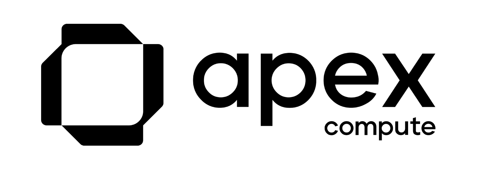
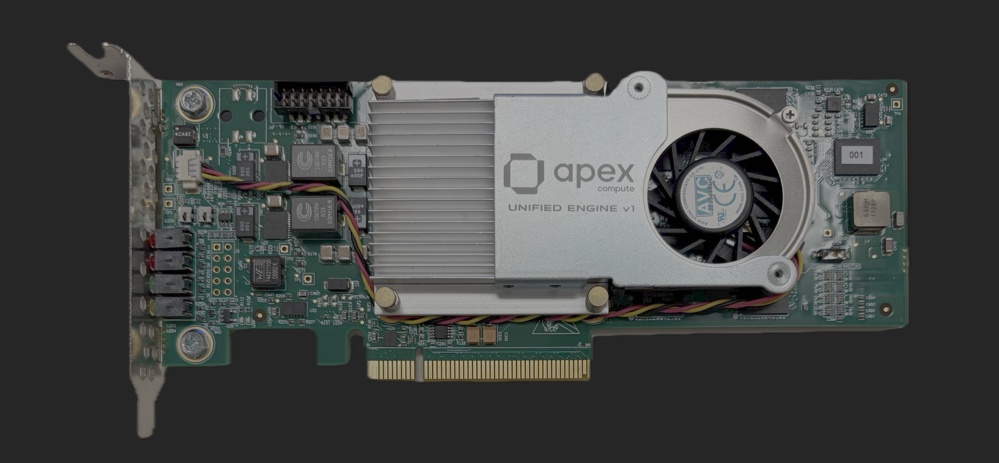
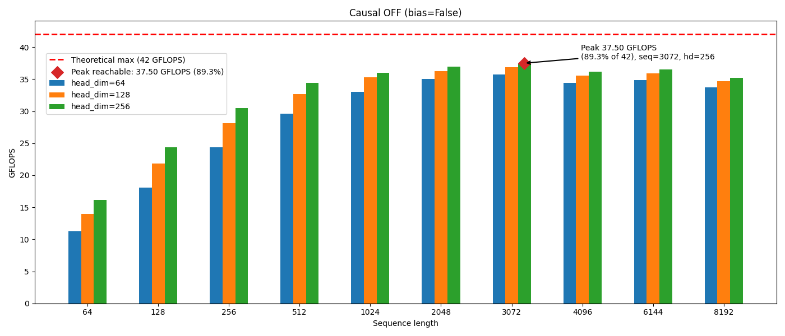
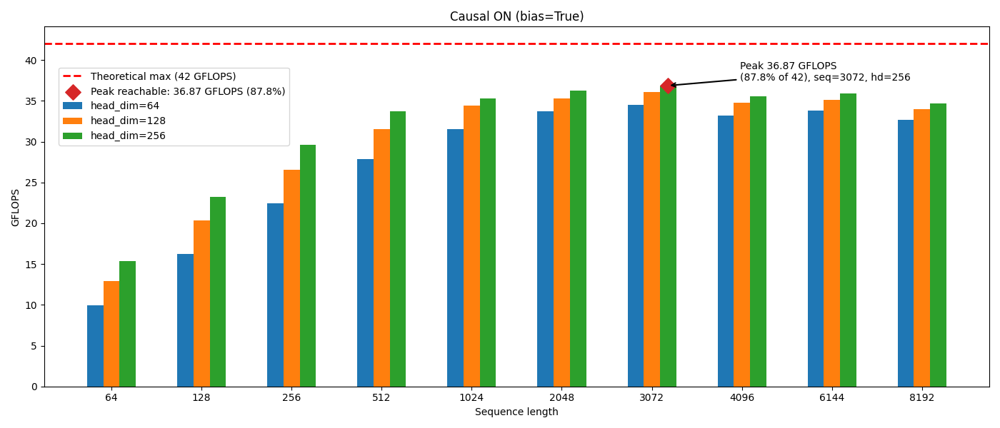
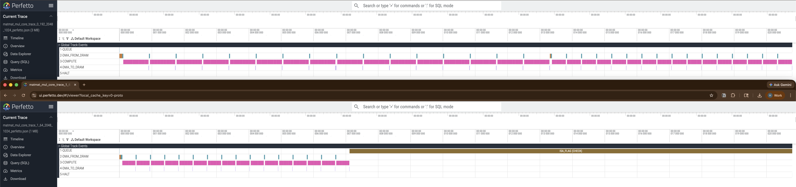

<p align="center">
  
</p>

<p align="center">
  Contributors: Hasan Unlu, Siqin Liu, Tin Nguyen, Rohit Rao, Dave Wei, Hiruna Vishwamith, Yinuo Zhao
</p>

<p align="center">
  Contact:
  <a href="mailto:hunlu@apexcompute.com">hunlu@apexcompute.com</a>,
  <a href="mailto:siqin.liu@apexcompute.com">siqin.liu@apexcompute.com</a>,
  <a href="mailto:tin.nguyen@apexcompute.com">tin.nguyen@apexcompute.com</a>,
  <a href="mailto:rohit@apexcompute.com">rohit@apexcompute.com</a>,
  <a href="mailto:dave.wei@apexcompute.com">dave.wei@apexcompute.com</a>,
  <a href="mailto:hiruna@apexcompute.com">hiruna@apexcompute.com</a>,
  <a href="mailto:yinuo.zhao@apexcompute.com">yinuo.zhao@apexcompute.com</a>
</p>

<p align="center">
  <a href="update_87eabea5.bin">&#9881;&#65039; Hardware Architecture Update v1.41(update_87eabea5.bin)</a>
</p>

<p align="center">
  <a href="#"></a><br>
  <a href="https://buy.stripe.com/6oUaEQf6365bgAt0QHds401">&#128722; Purchase FPGA Board with Unified Engine IP Block for $49.99</a><br>
  Includes ongoing hardware design updates so you always have the latest architecture.
</p>

<p align="center">
  <a href="http://discord.gg/hr9BwTUx"></a>
</p>

# XDMA Driver Setup and Usage Guide

This guide covers installation and usage of the Xilinx XDMA driver for PCIe-based FPGA communication.

## Prerequisites

- Kernel headers installed: `sudo apt install linux-headers-$(uname -r)`

## Installation

### 1. Install XDMA Driver from Xilinx Repository

Clone the official Xilinx DMA driver repository:
```bash
git clone https://github.com/Xilinx/dma_ip_drivers.git
cd dma_ip_drivers/XDMA/linux-kernel/xdma
sudo make install
```
> **Tip:** If `sudo make install` fails, you may need to disable Secure Boot in your BIOS settings.

### 2. Load the Driver

Load the XDMA driver with interrupt mode 0 (auto-detect):
```bash
sudo insmod /lib/modules/$(uname -r)/xdma/xdma.ko interrupt_mode=0
```

### 3. Load the Driver Every Boot Automatically (Recommended)

Apply the following script
```bash
# 1. Remove any conflicting configs
sudo rm -f /etc/modprobe.d/blacklist-xdma.conf \
           /etc/modprobe.d/xdma.conf \
           /etc/modules-load.d/xdma.conf

# 2. Create systemd service
sudo tee /etc/systemd/system/xdma.service << 'EOF'
[Unit]
Description=Xilinx XDMA Driver
After=local-fs.target

[Service]
Type=oneshot
ExecStart=/bin/sh -c '/sbin/insmod /lib/modules/$(uname -r)/xdma/xdma.ko || true'
ExecStartPost=/bin/sh -c 'chmod 666 /dev/xdma*'
RemainAfterExit=yes

[Install]
WantedBy=multi-user.target
EOF

# 3. Enable and start
sudo systemctl daemon-reload
sudo systemctl enable xdma
sudo systemctl restart xdma

# 4. Verify
sudo systemctl status xdma
ls -la /dev/xdma* | head -5
```

### 4. Set Up Python Environment

```bash
python3 -m venv ~/my_torch_env
source ~/my_torch_env/bin/activate
pip install -r requirements.txt
```

### 5. Run Hardware Tests

```bash
python3 user_hw_test.py
```

#### Multi-engine memory bandwidth comparison

The hardware suite includes a private-window versus split-region memory test
for Kintex-7, Alveo U50, and U55C multi-engine images. To run just the memory
comparison on the selected device:

```bash
python3 multi_engine_memory_test.py --dev xdma1 \
  --sizes-kib 64 256 512 --iterations 32 --samples 5 \
  --json /tmp/kintex7-memory.json
```

For each buffer size, the standalone test measures each engine individually,
then all selected engines concurrently with identical bytes per engine. **Private**
uses each engine's board-assigned DRAM window; **split** gives each engine a
nonoverlapping contiguous slice of one shared flat DRAM region. On the 4 GiB
Kintex-7 image the default private buffers are 2 GiB apart, on different DDR3
controllers. The runner also measures the previous 512 MiB spacing, which
places both buffers on the same controller.

Use `--private-spacing-mib 2048` to request that spacing explicitly
(`0x08000000` and `0x88000000` on the 4 GiB Kintex-7 image). Individual engine
baselines use the same addresses as the private comparison; ISA programs keep
their board-assigned addresses. U50 uses its 512 MiB controller windows, and
U55C uses its stack/controller map instead of assuming the same address stride.
The runner rejects spacing that overlaps data or ISA storage or exceeds the
reported DRAM capacity.

Read and write results report aggregate MB/s from the master engine's hardware
timer, including instruction and synchronization overhead and excluding PCIe
uploads and readbacks. Each iteration reuses the same buffer; this measures
repeated transfers rather than a sweep across all DRAM. Every sample checks
the read/write round trip bit for bit. The JSON output preserves the results
for comparison across runs.

Measured on p2 with 512 KiB per engine, 32 iterations, and three samples:

| Board / engines | Placement | Read GB/s | Write GB/s |
| --- | --- | ---: | ---: |
| Kintex-7 / 2 | Private, 512 MiB apart | 6.85 | 7.43 |
| Kintex-7 / 2 | Private, 2 GiB apart | 12.61 | 11.99 |
| U50 / 8 | Adjacent split | 10.66 | 10.67 |
| U50 / 8 | Private controller windows | 81.02 | 80.57 |

All samples passed exact read/write checks. These are aggregate device-memory
rates, not PCIe transfer rates or model throughput. U55C placement has offline
coverage; a U55C board was not available for measurement.

For Qwen3 0.6B, Llama3.2 1B, and Gemma3 1B, compare single-engine and
controller-sharded decode with identical-token validation:

```bash
python3 model_controller_benchmark.py --dev xdma1 --engines 2 \
  --models qwen llama gemma --json kintex7-models.json
python3 model_controller_benchmark.py --dev xdma0 --engines 8 \
  --models qwen llama gemma --json u50-models.json
```

The model map reserves a contiguous 2 GiB span for shared tensors and original
weights. On Kintex-7, private decode shards therefore start at 0 and 3 GiB,
still on different controllers; the standalone memory test uses exactly 2 GiB
spacing. Model parameters must be available through each model's normal setup.

Measured average FPGA decode latency for matching token sequences:

| Model | Kintex-7: 1 → 2 engines | U50: 1 → 8 engines |
| --- | ---: | ---: |
| Qwen3 0.6B | 93.39 → 67.22 ms (1.39×) | 58.47 → 30.54 ms (1.91×) |
| Llama3.2 1B | 118.18 → 64.97 ms (1.82×) | 74.45 → 16.38 ms (4.54×) |
| Gemma3 1B | 95.77 → 52.16 ms (1.84×) | 60.28 → 13.11 ms (4.60×) |
| Qwen2.5 VL-3B, text | Not measured | 211.00 → 33.62 ms (6.28×) |
| Gemma4 E4B, text | Does not fit this layout | 380.95 → 249.47 ms (1.53×) |

The common prompt is `Solve 2x + 3 = 7. Reply with only the value of x.`
Qwen3 comparisons cover 128 generated tokens under a cap; Llama, Gemma3, and
Qwen VL reach their stop token after 36, 70, and 5 steps respectively. These
are decode timings, excluding model preparation, prefill, and host processing.
Use `--models qwen_vl` to repeat the VL text comparison. The `*_controller_results.json`
files at the repository root preserve token IDs, placement, and board identity.

Gemma4 E4B uses the prompt `x+3=5, what is x?` and matches all 32 generated
tokens under its cap. Its Q/K/V/O and gate/up projections use private HBM;
down projection and LM head retain their original primary kernels. Repeat
with `--models e4b --max-new-tokens 32`. U50 needs at least four active
engines to fit these copies; eight were measured.

Gemma4 E2B's controller/cache changes are implemented, but its comparison
remains unvalidated: repeated eight-engine runs produced different tokens
with identical compiled instruction bytes, including the previous compiler.
See `gemma4_e2b_existing_eight_comparison.json` for that repeatability check.
The runner's `--models e2b` case rejects padding-only output and fails on
token mismatch instead of reporting a correctness pass.

Existing eight-engine model paths also use controller placement for SmolVLM2
decode gate/up weights, pi0.5 vision copies, ACT matrix/convolution weights,
VeraPulse vision projections, and Kokoro generator convolution taps. These
changes have offline allocation, exact-copy, and cache-replay tests; their
model throughput has not been remeasured. Fixed low-4-GiB model layouts use
free upper HBM regions on Alveo and retain shared weights when no separate
controller region fits on Kintex-7. Qwen Omni's existing whole-device layout
was already suitable and remains in place.

Run the offline tests without opening an FPGA device:

```bash
python3 -m unittest discover -s tests
```

Gemma4 E2B preserves its existing eight-engine tiled map; smaller configurations
now use controller-aware windows, and cached programs record the exact map.
Its capped U50 runs produced meaningful text at 141.19 → 33.79 ms/token, but
single/eight-engine tokens differ and repeated eight-engine runs also differ.
The old and new eight-engine compilers emitted byte-identical instructions;
only their cache-layout metadata changed. This remains a repeatability failure,
so the 4.18× timing ratio is **not a validated model speedup**. See
`gemma4_e2b_controller_results.json` and
`gemma4_e2b_existing_eight_comparison.json` for the failed checks. The shared
benchmark rejects matching padding-only or empty decoded output.

Use `--models e2b` or `--models e4b` with `--max-new-tokens` for bounded Gemma4
comparisons. E4B retains the original shared 0–4 GiB model image and places
private Q/K/V/O/gate/up decode weights above 4 GiB. On U50, 4–8 engines fit;
2–3 engines fail the private-capacity check before loading weights. Its large
MLP down projection and LM head retain their original primary kernels.
E4B passed 32 identical generated tokens on the same algebra prompt:
380.95 → 249.47 ms/token (1.53×) on U50. The result is saved in
`alveo_u50_gemma4_e4b_controller_results.json`; prefill remains on the primary engine.

### 6. Run Gemma3 Inference (requires Hugging Face)

The Gemma3 test downloads the gated [google/gemma-3-1b-it](https://huggingface.co/google/gemma-3-1b-it) model from Hugging Face. You need to:

1. Create a Hugging Face account at https://huggingface.co
2. Accept the Gemma license at https://huggingface.co/google/gemma-3-1b-it
3. Create an access token at https://huggingface.co/settings/tokens
4. Log in from the command line:

```bash
pip install huggingface-hub
huggingface-cli login
```

Then run:

```bash
python3 models/gemma3/gemma3_test.py --prompt "your prompt"
```

### 7. Updating HW bin file

> **Qwen2.5-Omni U55C:** do not run this generic update procedure for the
> Omni runner. It validates the already-installed supported image and never
> reprograms the FPGA; see [`models/qwen2.5_omni_7b/README.md`](models/qwen2.5_omni_7b/README.md).

The current hardware release is **v1.4** (`update_006e0d2f.bin`). At startup the software reads the FPGA version register and checks it against the expected release hash (`0x006e0d2f`); on a mismatch it stops and tells you which bin to flash.

```
./update_fpga.sh
```

One command does the whole update, no PC reboot or power cycle. With no arguments it picks up the `update_*.bin` in the repo root, checks the running version first and exits immediately if the FPGA is already up to date; otherwise it programs and verifies the flash, warm-boots the FPGA from the new image (ICAPE2 IPROG) via `update_flash.py`, hot-rescans the PCIe bus (`sudo ./rescan_xilinx.sh` — the one step that needs root), then reads the FPGA version back and prints `UPDATE SUCCESSFUL` when it matches the bin.

If the image currently running predates the warm-boot block, the flash is still written but there is nothing to warm boot into: the script says so, tells you to cold reboot once, and stops before the PCIe rescan (exit code 3). After that one cold boot every update is reboot-free.

Options:

```
./update_fpga.sh --bin update_006e0d2f.bin   # explicit image (or pass it positionally)
./update_fpga.sh --check                     # device ID + running FPGA hash vs the repo bin
./update_fpga.sh --boot                      # no reflash: warm boot from flash, rescan
./update_fpga.sh --force                     # reflash even if already up to date
```

### Kintex-7 encrypted BIN + eFUSE provisioning over JTAG

[`provision_kintex7.py`](provision_kintex7.py) handles the unified-engine
**XC7K480T + MT28GU512 BPI-x16, 64 MiB** board. Source Vivado's
`settings64.sh` first; Python 3.8+ and Vivado Hardware Manager are required.
It works independently of the PCIe/XDMA device numbering.

```bash
# Inventory all cables and devices; no programming.
python3 provision_kintex7.py --list

# Read-only preflight (also the default without --check).
python3 provision_kintex7.py encrypted.bin --key /secure/andromeda_wrapper.nky --check

# Permanently burn the key, protect it, then erase/program/verify BPI flash.
python3 provision_kintex7.py encrypted.bin --key /secure/andromeda_wrapper.nky --program

# Optional: pin the cable/device/DNA printed by --list or --check, and boot.
python3 provision_kintex7.py encrypted.bin --key /secure/andromeda_wrapper.nky \
  --target CABLE_SERIAL --device xc7k480t_0 --dna DEVICE_DNA --program --boot

# Subsequent updates: use an image encrypted for the already-fused key.
python3 provision_kintex7.py encrypted.bin --flash-only --boot

# Make equivalent: omit PROGRAM=1 for the read-only check.
make kintex7_efuse_flash BINFILE=encrypted.bin NKY_FILE=/secure/andromeda_wrapper.nky PROGRAM=1
```

The matching `.nky` is required for provisioning: the AES key cannot be
extracted from an encrypted `.bin`. If `--key` is omitted, `encrypted.bin`
uses `encrypted.nky` beside it. Keep both files from the same build. The
input must be the encrypted flash image generated with
`write_cfgmem -format bin -size 64 -interface BPIx16 -loadbit "up 0x0 design.bit"`;
the design must use `BITSTREAM.ENCRYPTION.ENCRYPTKEYSELECT EFUSE`.
The script checks the BIN's clear encryption header and payload length and
the NKY's device/key format. These checks **do not prove the key matches the
ciphertext**, authenticate the image, or identify the part inside its encrypted
payload. Use the XC7K480T build's matching image/key pair.

Every cable is scanned unless `--target` specifies an exact target path or
unique serial. Selection must produce exactly one XC7K480T. Unreachable
cables, failed device reads and ambiguous matches stop the operation.
The device is identified by cable, device name, part and DNA, then reacquired
and checked after reopening its cable. No fallback selects the first FPGA.
`--server HOST:3121` selects a remote hardware server.

**`--program` is irreversible authorization.** It refuses an already-fused
AES key or locked key/control registers. It uses the existing Andromeda policy:
`FUSE_USER=0` and `FUSE_CNTL=0x0c` (key write/read protection). Programming
the AES key consumes the opportunity to provision `FUSE_USER[7:0]`; this
flow fixes those bits at zero. It leaves `CFG_AES_Only` unset because setting
that bit prevents Vivado indirect BPI flash programming. This flow does not
enforce encrypted-only configuration. See AMD's
[7-series encryption application note, XAPP1239](https://docs.amd.com/api/khub/documents/YQb~HIRtTDxDtDfWt3JdNw/content).
Use an [eFUSE-capable JTAG cable](https://docs.amd.com/r/en-US/ug908-vivado-programming-debugging/Cable-Support-for-eFUSE-Programming)
and a powered board with stable supply rails.

Programming replaces the running FPGA configuration with Vivado's flash helper,
so stop workloads first. The script checks AES-programmed status and protection
bits after burning, then programs flash with verification enabled. `--boot`
boots from flash and checks DONE; without it, power-cycle the board to load
the image. PCIe rescanning is separate. `--flash-only` never burns fuses and
requires an already-programmed AES key; it cannot compare a read-protected key
with the input image. A verified flash write alone does not prove successful
decryption or application operation.

Each run keeps a device record, result JSON and any generated **secret NKZ
export** in a private directory under `~/.local/state/unified-engine/efuse/`
(override with `--output-dir`). Input snapshots are deleted on exit; Vivado
logs/journals are disabled and long key values are redacted from its console
output. Protect NKZ exports like the original key. If flash fails after the
fuse burn succeeds, preserve the export and retry with `--flash-only` using
the same encrypted image. Never attempt to burn a replacement key.

Hardware-independent regression checks:

```bash
python3 -m unittest discover -s tests -p 'test_provision_kintex7.py'
```

---

## Supported Models

Gemma3 above is just the quick-start example. Every model below runs on the
engine today; each folder has its own README/config, and most LLMs ship a
`*_run_from_bin.py` for execute-only deploys from precompiled bins.

| Model | Folder | Type |
|---|---|---|
| Gemma 3 1B | [`models/gemma3`](models/gemma3) | Text LM |
| Gemma 4 E2B | [`models/gemma4_e2b`](models/gemma4_e2b) | Multimodal LM (text, vision, audio) |
| Gemma 4 E4B | [`models/gemma4_e4b`](models/gemma4_e4b) | Multimodal LM (text, vision, audio) |
| Llama 3.2 1B | [`models/llama3.2_1b`](models/llama3.2_1b) | Text LM |
| Llama 3.2 3B | [`models/llama3.2_3b`](models/llama3.2_3b) | Text LM |
| Qwen3 0.6B | [`models/qwen3_0.6b`](models/qwen3_0.6b) | Text LM |
| Qwen3 1.7B | [`models/qwen3_1.7b`](models/qwen3_1.7b) | Text LM |
| Qwen3 4B | [`models/qwen3_4b`](models/qwen3_4b) | Text LM |
| Qwen3.5 2B | [`models/qwen3.5_2b`](models/qwen3.5_2b) | Text LM |
| Qwen2.5-VL 3B | [`models/qwen2.5_vl_3b`](models/qwen2.5_vl_3b) | Vision-language |
| Qwen2.5-Omni 7B | [`models/qwen2.5_omni_7b`](models/qwen2.5_omni_7b) | Multimodal Thinker (text, image, audio -> text) |
| SmolVLM2 | [`models/smolvlm2`](models/smolvlm2) | Vision-language |
| GPT-2 | [`models/gpt2`](models/gpt2) | Text LM |
| LocateAnything 3B | [`models/locateanything_3b`](models/locateanything_3b) | Open-vocabulary localization |
| MobileNetV2 (224 + SSD-FPNLite 640) | [`models/mobilenetv2`](models/mobilenetv2) | Classification / detection |
| Parakeet | [`models/parakeet`](models/parakeet) | Speech recognition (incl. streaming) |
| MobileSAM | [`models/mobilesam`](models/mobilesam) | Segmentation |
| Swin | [`models/swin`](models/swin) | Image classification |

Qwen2.5-Omni-7B currently accelerates the Thinker path: text, image, and audio
inputs produce text. It targets the 8 GiB Alveo U55 configuration and runs on
engines 0-7; HW_INFO must report 8 GiB and at least eight available engines.

```bash
# Text
python models/qwen2.5_omni_7b/qwen2.5_omni_7b_test.py --multi-core 8 \
  --prompt "If x + 3 = 5, what is x?"

# Image (bare --image uses test_samples/yosemite.jpg)
python models/qwen2.5_omni_7b/qwen2.5_omni_7b_test.py --multi-core 8 --image

# Audio
python models/qwen2.5_omni_7b/qwen2.5_omni_7b_test.py --multi-core 8 \
  --audio test_samples/apex.wav --prompt "Transcribe the speech exactly."
```

Run the whole suite (or a subset) with the automated tester:

```bash
make model_test run_from_bin   # skip the pre-clean, reuse existing compiled bins
make model_test gemma4_e2b     # one model
make model_test_help           # all modes
```

Notes on the two modes:

- Without the `run_from_bin` word, `model_test` runs `make clean` first,
  which deletes cached model bins and rebuilds everything from the HF
  models (slow; needs the HF models available).
- `run_from_bin` skips the pre-clean so models with a
  `*_run_from_bin.py` runtime (the LLM/VLM rows above) reuse their bins.
  gemma3, gpt2 and the vision/speech models have no runtime-only entry
  yet and still run through their `*_test.py` scripts, which need their
  model assets on disk. On a deploy host that only has pregenerated
  bins, run the runtime-only subset by name, e.g.
  `make model_test gemma4_e2b llama3.2_1b qwen3_4b run_from_bin`.

---

## Apex Compute Unified Engine v1.1 — Benchmark Results

All benchmarks were collected on RTL running on a Kintex UltraScale+ FPGA in real time.

### Benchmark Datasheet

<a href="benchmark_datasheet.pdf">📄 Download Benchmark Datasheet (PDF)</a>

| Specification | Value |
|---|---|
| Engine frequency | 333 MHz |
| Theoretical peak (BF16) | 42 GFLOPS/s |
| Memory interface | DDR4 @ 1333 MHz, 32-bit |
| AXI Master Data Width | 256 bits |
| On-chip SRAM | 1.05 MB |
| Total power | 4.5 W |
| BF16 MatMul | 40.17 GFLOPS/s (95.6% utilization) |
| BF16 MatMul + Bias + Activation | 40.03 GFLOPS/s (95.3% utilization) |
| BF16 Softmax MatMul | 37.76 GFLOPS/s (89.9% utilization) |
| Memory-Efficient Attention | ~90% utilization |
| Quantized MatMul (BF16 × INT4/FP4) | 40.03 GFLOPS/s (95.3% utilization) |
| Quantized MatVec (Streaming matrix, decoding mode friendly) (BF16 × INT4/FP4) | 31.33 GFLOPS/s (74.6% utilization) |
| RMSNorm | 4.81 GFLOPS/s |
| LayerNorm | 5.90 GFLOPS/s |
| Quantize (BF16 → INT4/FP4) | 5.72 GFLOPS/s |
| Dequantize (INT4/FP4 → BF16) | 3.31 GFLOPS/s |
| Hardware trace buffer | 8,192 timestamps |
| Multi-engine tensor parallelism | Supported with Synchronization Flag instructions |

### FPGA Presilicon Prototype Setup

#### System Parameters

| Parameter | Value |
|---|---|
| Memory interface | DDR4 at 1333 MHz, 32-bit data path |
| Engine frequency | 333 MHz |
| Memory interface clock | Synchronized 1:1 with engine clock |
| Data width | 256 bits |
| Total power consumption | 4.5 W |
| Total on-chip SRAM | 1.05 MB |

#### Peak Operation Rate

Total floating-point operations per second from the engine at 333 MHz is approximately **42 GFLOPS/s**.

#### FPGA Resource Utilization

| Name | CLB LUTs | CLB Registers | Block RAM Tile | URAM | DSPs |
|---|---|---|---|---|---|
| unified_engine_top | 78,348 | 50,045 | 16 | 30 | 197 |

### FLOPS Definitions

| Operation | FLOPS |
|---|---|
| FMA (Fused Multiply-Add) | 2 |
| Addition / Multiplication | 1 |
| Exponent | 1 |
| Division | 1 |

### BF16 Operation Benchmarks

Engine speed: **333 MHz**; theoretical peak: **42 GFLOPS/s**. Metrics based on **M=1024, K=1024, N=1024**. O denotes the output tensor. All matrix-matrix operations we are reaching up to **95% FLOPS** utilizations.

<table>
<tr><th>Op</th><th>Operands</th><th>FLOPS</th><th>Cycles (latency)</th><th>Achieved GFLOPS/s</th></tr>
<tr><td>A Bᵀ</td><td>A[M,K], B[N,K] → O[M,N]</td><td>2MKN</td><td>17,820,455 (53.3 ms)</td><td>40.17</td></tr>
<tr><td>A Bᵀ + C</td><td>A[M,K], B[N,K], C[M,N] → O[M,N]</td><td>2MKN + MN</td><td>17,858,564 (53.5 ms)</td><td>40.10</td></tr>
<tr><td>GELU(A Bᵀ)</td><td>A[M,K], B[N,K] → O[M,N]</td><td>2MKN + 4MN</td><td>17,923,045 (53.7 ms)</td><td>40.02</td></tr>
<tr><td>GELU(A Bᵀ + C)</td><td>A[M,K], B[N,K], C[M,N] → O[M,N]</td><td>2MKN + MN + 4MN</td><td>17,927,850 (53.7 ms)</td><td>40.03</td></tr>
<tr><td>SiLU(A Bᵀ)</td><td>A[M,K], B[N,K] → O[M,N]</td><td>2MKN + 4MN</td><td>17,921,594 (53.7 ms)</td><td>40.02</td></tr>
<tr><td>SiLU(A Bᵀ + C)</td><td>A[M,K], B[N,K], C[M,N] → O[M,N]</td><td>2MKN + MN + 4MN</td><td>17,926,623 (53.7 ms)</td><td>40.03</td></tr>
<tr><td>softmax(A Bᵀ)</td><td>A[M,K], B[N,K] → O[M,N]</td><td>2MKN + 5MN</td><td>19,004,997 (57.01 ms)</td><td>37.76</td></tr>
<tr><td>softmax(A Bᵀ + C)</td><td>A[M,K], B[N,K], C[M,N] → O[M,N]</td><td>2MKN + MN + 5MN</td><td>19,051,310 (57.15 ms)</td><td>37.68</td></tr>
<tr><td>Aᵀ</td><td>A[M,N] → O[N,M]</td><td>0</td><td>1,648,647 (4.9 ms)</td><td>N/A</td></tr>
<tr><td>A · scalar</td><td>A[M,N] → O[M,N]</td><td>MN</td><td>180,500 (541 µs)</td><td>1.94</td></tr>
<tr><td>A + scalar</td><td>A[M,N] → O[M,N]</td><td>MN</td><td>181,005 (543 µs)</td><td>1.93</td></tr>
<tr><td>A · B</td><td>A[M,N], B[M,N] → O[M,N]</td><td>MN</td><td>263,580 (790 µs)</td><td>1.33</td></tr>
<tr><td>A + B</td><td>A[M,N], B[M,N] → O[M,N]</td><td>MN</td><td>263,871 (791 µs)</td><td>1.33</td></tr>
<tr><td>RMSNorm(A) · γ</td><td>A[M,N], γ[N] → O[M,N]</td><td>4MN</td><td>290,945 (872 µs)</td><td>4.81</td></tr>
<tr><td>LayerNorm(A) · γ + β</td><td>A[M,N], γ[N], β[N] → O[M,N]</td><td>7MN</td><td>414,679 (1.24 ms)</td><td>5.90</td></tr>
</table>

#### Memory-Efficient Attention

The following kernel computes the attention block for given query/key/value tensors and an optional mask or bias. It reaches almost **90% utilization** of theoretical FLOPS.

```
memory_efficient_attention(q, k, v, mask_or_bias)
```

Equivalent PyTorch reference:

```python
def memory_efficient_attention(q, k, v, attn_bias=None):
    scale = 1.0 / math.sqrt(head_dim)
    attn_weights = (q @ k.T) * scale
    if attn_bias is not None:
        attn_weights = attn_weights + attn_bias
    scores = torch.softmax(attn_weights, dim=-1)
    return scores @ v
```

<p align="center">
  <br>
  <em>Flash attention benchmark — bias off</em>
</p>

<p align="center">
  <br>
  <em>Flash attention benchmark — bias on</em>
</p>

### Quantized Operation Benchmarks

Engine speed: 333 MHz; theoretical peak: 42 GFLOPS/s. In quantized mode, achieved FLOPS are the same **for any M**. In contrast, for tiled matrix-matrix multiplication, smaller M reduces FLOPS utilization. fp4 refers to nvfp4 (Nvidia fp4).

Metrics based on M=1024, K=1024, N=1024.

<table>
<tr><th>Op</th><th>Precision</th><th>Operands</th><th>FLOPS</th><th>Cycles (latency)</th><th>Achieved GFLOPS/s</th></tr>
<tr><td>A Bᵀ</td><td>A(bf16) B(int4/fp4) O(bf16)</td><td>A[M,K], B[N,K] → O[M,N]</td><td>2MKN</td><td>22,849,177 (68.5 ms)</td><td>31.33</td></tr>
<tr><td>A Bᵀ + C</td><td>A(bf16) B(int4/fp4) C(bf16) O(bf16)</td><td>A[M,K], B[N,K], C[M,N] → O[M,N]</td><td>2MKN + MN</td><td>23,073,635 (69.2 ms)</td><td>31.04</td></tr>
<tr><td>GELU(A Bᵀ)</td><td>A(bf16) B(int4/fp4) O(bf16)</td><td>A[M,K], B[N,K] → O[M,N]</td><td>2MKN + 4MN</td><td>22,850,336 (68.5 ms)</td><td>31.39</td></tr>
<tr><td>GELU(A Bᵀ + C)</td><td>A(bf16) B(int4/fp4) C(bf16) O(bf16)</td><td>A[M,K], B[N,K], C[M,N] → O[M,N]</td><td>2MKN + MN + 4MN</td><td>23,100,231 (69.3 ms)</td><td>31.06</td></tr>
<tr><td>SiLU(A Bᵀ)</td><td>A(bf16) B(int4/fp4) O(bf16)</td><td>A[M,K], B[N,K] → O[M,N]</td><td>2MKN + 4MN</td><td>22,850,243 (68.5 ms)</td><td>31.39</td></tr>
<tr><td>SiLU(A Bᵀ + C)</td><td>A(bf16) B(int4/fp4) C(bf16) O(bf16)</td><td>A[M,K], B[N,K], C[M,N] → O[M,N]</td><td>2MKN + MN + 4MN</td><td>23,104,094 (69.3 ms)</td><td>31.06</td></tr>
</table>

#### Quantization / Dequantization (N=131,072)

<table>
<tr><th>Op</th><th>Precision</th><th>Operands</th><th>FLOPS</th><th>Cycles (latency)</th><th>Achieved GFLOPS/s</th></tr>
<tr><td>Quantize(A)</td><td>A(bf16) O(int4/fp4)</td><td>A[N] → O[N]</td><td>2N</td><td>15,266 (45.8 µs)</td><td>5.72</td></tr>
<tr><td>Dequantize(A)</td><td>A(int4/fp4) O(bf16)</td><td>A[N] → O[N]</td><td>N</td><td>13,193 (39.5 µs)</td><td>3.31</td></tr>
</table>

### Trace Buffer and Tensor Parallelism

The engine includes a hardware trace buffer capable of recording **8,192 timestamps**, allowing cycle-accurate profiling of kernel execution. This is useful for experimenting with tensor parallelism across multiple engines.

The example below demonstrates splitting a 256×2048 @ 2048×1024 matrix multiplication across two engines:

- **Engine 0:** 192×2048 @ 2048×1024 (larger partition)
- **Engine 1:** 64×2048 @ 2048×1024 (smaller partition)

Because the two partitions have unequal workloads, the smaller partition finishes before the larger one. A hardware **synchronization flag** is used to hold the faster engine until both are complete before proceeding to the next stage. The trace visualization below shows this synchronization in action — the idle gap on Engine 1 is where it waits for Engine 0 to finish.

<p align="center">
  <br>
  <em>Trace buffer visualization — 256×2048 @ 2048×1024 split across two engines with hardware synchronization</em>
</p>
